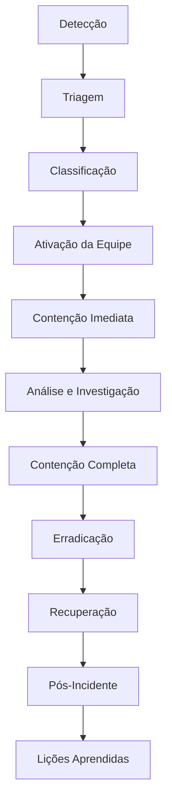

# 🚨 PLANO DE RESPOSTA A INCIDENTES - SISTEMA PONTO DIGITAL

## 🎯 OBJETIVO

Este documento estabelece o Plano de Resposta a Incidentes (IRP) para o Sistema Ponto Digital, definindo procedimentos estruturados para detectar, conter, erradicar e recuperar-se de incidentes de segurança da informação.

---

## 📋 ÍNDICE

1. [Definições e Escopo](#definições-e-escopo)
2. [Organização da Resposta](#organização-da-resposta)
3. [Classificação de Incidentes](#classificação-de-incidentes)
4. [Processo de Resposta](#processo-de-resposta)
5. [Procedimentos por Tipo de Incidente](#procedimentos-por-tipo-de-incidente)
6. [Comunicação e Escalação](#comunicação-e-escalação)
7. [Ferramentas e Recursos](#ferramentas-e-recursos)
8. [Treinamento e Exercícios](#treinamento-e-exercícios)

---

## 🔍 DEFINIÇÕES E ESCOPO

### **Definição de Incidente de Segurança**
Um incidente de segurança é qualquer evento que comprometa ou possa comprometer a confidencialidade, integridade ou disponibilidade dos dados e sistemas do Ponto Digital.

### **Tipos de Incidentes Cobertos**
```yaml
Segurança Cibernética:
  - Malware (vírus, ransomware, trojans)
  - Ataques de rede (DDoS, man-in-the-middle)
  - Invasões e comprometimento de sistemas
  - Phishing e engenharia social
  - Vulnerabilidades zero-day

Vazamento de Dados:
  - Acesso não autorizado a dados pessoais
  - Exposição de dados biométricos
  - Vazamento de credenciais
  - Perda de dispositivos com dados

Fraude e Abuso:
  - Uso indevido de credenciais
  - Fraude em registros de ponto
  - Abuso de privilégios administrativos
  - Violação de políticas internas

Disponibilidade:
  - Falhas de sistema críticas
  - Interrupções de serviço
  - Corrupção de dados
  - Problemas de performance críticos

Físico:
  - Roubo/perda de equipamentos
  - Acesso físico não autorizado
  - Sabotagem de infraestrutura
  - Desastres naturais
```

### **Escopo de Aplicação**
- **Sistemas**: Todos os componentes do Ponto Digital
- **Dados**: Dados biométricos, pessoais e corporativos
- **Infraestrutura**: Servidores, rede, totems, dispositivos móveis
- **Pessoas**: Colaboradores, usuários, terceiros
- **Processos**: Todos os processos de negócio relacionados

---

## 👥 ORGANIZAÇÃO DA RESPOSTA

### **Equipe de Resposta a Incidentes (CSIRT)**

#### **Estrutura Organizacional**
```yaml
Coordenador de Incidentes (IC):
  - Responsabilidade: Coordenação geral da resposta
  - Autoridade: Decisões técnicas e operacionais
  - Perfil: CISO ou designado
  - Disponibilidade: 24x7 para P1/P2

Analistas de Segurança:
  - Responsabilidade: Análise técnica e investigação
  - Autoridade: Implementação de controles técnicos
  - Perfil: Especialistas em segurança
  - Disponibilidade: 24x7 (escala de plantão)

Especialistas Técnicos:
  - Responsabilidade: Suporte técnico especializado
  - Autoridade: Mudanças em sistemas específicos
  - Perfil: Administradores de sistema, DBAs, DevOps
  - Disponibilidade: Sob demanda

Comunicador:
  - Responsabilidade: Comunicação interna e externa
  - Autoridade: Aprovação de comunicações
  - Perfil: Gerente de TI ou Comunicação
  - Disponibilidade: Horário comercial + emergências

DPO (Data Protection Officer):
  - Responsabilidade: Aspectos de proteção de dados
  - Autoridade: Decisões relacionadas à LGPD
  - Perfil: Especialista em privacidade
  - Disponibilidade: Horário comercial + P1 LGPD

Jurídico:
  - Responsabilidade: Aspectos legais e regulatórios
  - Autoridade: Decisões sobre notificações oficiais
  - Perfil: Advogado especializado
  - Disponibilidade: Sob demanda
```

#### **Matriz RACI**
```yaml
Atividade | IC | Analista | Técnico | Comunicador | DPO | Jurídico
----------|----|---------|---------|-----------|----|----------
Triagem   | A  | R       | C       | I         | I  | I
Análise   | A  | R       | R       | I         | C  | C
Contenção | A  | R       | R       | I         | C  | I
Comunicação| A | I       | I       | R         | C  | C
Erradicação| A | R       | R       | I         | I  | I
Recuperação| A | R       | R       | I         | I  | I
Documentação| A| R       | C       | R         | C  | C

Legenda: R=Responsável, A=Aprovador, C=Consultado, I=Informado
```

### **Ativação da Equipe**

#### **Critérios de Ativação**
```yaml
Automática:
  - Incidentes P1 (Críticos)
  - Alertas de sistemas críticos
  - Detecção de malware/ransomware
  - Vazamento confirmado de dados

Manual:
  - Incidentes P2/P3 complexos
  - Suspeita de comprometimento
  - Solicitação de stakeholders
  - Eventos de mídia negativa

Escalação:
  - Falha na contenção em 2 horas
  - Impacto crescente
  - Envolvimento de autoridades
  - Interesse da mídia
```

#### **Procedimento de Ativação**
```yaml
Passo 1: Detecção (0-5 min)
  - Sistema/pessoa detecta incidente
  - Alerta automático ou manual
  - Registro inicial no sistema
  - Notificação do analista de plantão

Passo 2: Triagem Inicial (5-15 min)
  - Analista valida o incidente
  - Classificação preliminar
  - Decisão de ativação da equipe
  - Notificação do IC

Passo 3: Ativação (15-30 min)
  - IC confirma ativação
  - Convocação da equipe necessária
  - Estabelecimento de sala de guerra
  - Início da coordenação

Passo 4: Mobilização (30-60 min)
  - Equipe se reporta
  - Briefing inicial
  - Atribuição de responsabilidades
  - Início das atividades
```

---

## 📊 CLASSIFICAÇÃO DE INCIDENTES

### **Matriz de Classificação**

#### **Critérios de Impacto**
```yaml
CRÍTICO (4):
  - Comprometimento de dados biométricos
  - Vazamento massivo de dados pessoais
  - Ransomware ativo em sistemas críticos
  - Comprometimento total de infraestrutura
  - Impacto legal/regulatório significativo

ALTO (3):
  - Acesso não autorizado a dados sensíveis
  - Comprometimento parcial de sistemas
  - Malware em sistemas não críticos
  - Violação de múltiplas políticas
  - Impacto operacional significativo

MÉDIO (2):
  - Tentativas de acesso não autorizado
  - Violação de política isolada
  - Falha de controles de segurança
  - Incidente de disponibilidade localizado
  - Impacto operacional limitado

BAIXO (1):
  - Eventos de segurança informativos
  - Violações menores de política
  - Falhas de sistema não críticas
  - Tentativas isoladas de ataque
  - Sem impacto operacional
```

#### **Critérios de Urgência**
```yaml
CRÍTICA (4):
  - Ameaça ativa em andamento
  - Propagação rápida
  - Dados sendo exfiltrados
  - Sistema crítico indisponível
  - Prazo regulatório crítico

ALTA (3):
  - Ameaça contida mas persistente
  - Risco de propagação
  - Possível exfiltração
  - Sistema importante afetado
  - Prazo regulatório próximo

MÉDIA (2):
  - Ameaça contida
  - Risco limitado de propagação
  - Sem evidência de exfiltração
  - Sistemas secundários afetados
  - Tempo suficiente para resposta

BAIXA (1):
  - Sem ameaça ativa
  - Sem risco de propagação
  - Sem evidência de comprometimento
  - Sistemas não críticos
  - Sem pressão temporal
```

#### **Matriz de Priorização**
```yaml
         | Crítica | Alta | Média | Baixa
---------|---------|------|-------|-------
Crítico  |   P1    |  P1  |  P2   |  P2
Alto     |   P1    |  P2  |  P2   |  P3
Médio    |   P2    |  P2  |  P3   |  P3
Baixo    |   P2    |  P3  |  P3   |  P4
```

### **SLAs por Prioridade**

```yaml
P1 - Crítico:
  - Tempo de Resposta: 15 minutos
  - Tempo de Contenção: 2 horas
  - Tempo de Resolução: 8 horas
  - Comunicação: Imediata + a cada hora
  - Escalação: Automática para direção

P2 - Alto:
  - Tempo de Resposta: 1 hora
  - Tempo de Contenção: 4 horas
  - Tempo de Resolução: 24 horas
  - Comunicação: 2 horas + a cada 4 horas
  - Escalação: Se não contido em 4h

P3 - Médio:
  - Tempo de Resposta: 4 horas
  - Tempo de Contenção: 8 horas
  - Tempo de Resolução: 72 horas
  - Comunicação: 4 horas + diariamente
  - Escalação: Se não contido em 8h

P4 - Baixo:
  - Tempo de Resposta: 24 horas
  - Tempo de Contenção: 72 horas
  - Tempo de Resolução: 1 semana
  - Comunicação: Diariamente
  - Escalação: Conforme necessário
```

---

## 🔄 PROCESSO DE RESPOSTA

### **Visão Geral do Processo**


### **Fase 1: Detecção e Triagem**

#### **Fontes de Detecção**
```yaml
Automáticas:
  - SIEM/SOC alerts
  - Antivírus/EDR
  - IDS/IPS
  - Monitoramento de infraestrutura
  - Alertas de aplicações

Manuais:
  - Relatórios de usuários
  - Descoberta durante auditoria
  - Notificação de terceiros
  - Análise proativa de ameaças
  - Monitoramento de mídia/dark web
```

#### **Procedimento de Triagem**
```yaml
Passo 1: Registro Inicial (0-5 min)
  - Criar ticket de incidente
  - Registrar fonte e timestamp
  - Coletar informações básicas
  - Atribuir ID único

Passo 2: Validação (5-10 min)
  - Confirmar veracidade do alerta
  - Eliminar falsos positivos
  - Coletar evidências iniciais
  - Avaliar credibilidade

Passo 3: Classificação Inicial (10-15 min)
  - Aplicar matriz de classificação
  - Determinar prioridade
  - Avaliar necessidade de escalação
  - Documentar decisão

Passo 4: Notificação (15-20 min)
  - Notificar IC se P1/P2
  - Comunicar stakeholders iniciais
  - Ativar procedimentos específicos
  - Iniciar cronômetro de SLA
```

### **Fase 2: Contenção**

#### **Contenção Imediata (0-2 horas)**
```yaml
Objetivos:
  - Parar a propagação do incidente
  - Preservar evidências críticas
  - Manter serviços essenciais
  - Preparar para análise detalhada

Ações Típicas:
  - Isolamento de sistemas comprometidos
  - Bloqueio de IPs/domínios maliciosos
  - Desativação de contas comprometidas
  - Interrupção de processos suspeitos
  - Snapshot de sistemas para análise

Decisões Críticas:
  - Manter sistemas online vs. isolar
  - Preservar evidências vs. restaurar serviços
  - Comunicar vs. manter confidencialidade
  - Envolver autoridades vs. resolver internamente
```

#### **Contenção Sustentada (2-24 horas)**
```yaml
Objetivos:
  - Implementar controles duradouros
  - Permitir operação segura continuada
  - Facilitar investigação detalhada
  - Preparar para erradicação

Ações Típicas:
  - Implementação de patches emergenciais
  - Configuração de controles temporários
  - Estabelecimento de monitoramento intensivo
  - Backup de sistemas críticos
  - Implementação de workarounds
```

### **Fase 3: Erradicação**

#### **Análise de Causa Raiz**
```yaml
Investigação Técnica:
  - Análise forense de sistemas
  - Análise de malware
  - Revisão de logs detalhada
  - Mapeamento de cronologia
  - Identificação de vetores de ataque

Análise de Processo:
  - Revisão de controles de segurança
  - Identificação de gaps
  - Avaliação de políticas
  - Análise de fatores humanos
  - Revisão de procedimentos
```

#### **Remoção de Ameaças**
```yaml
Limpeza de Sistemas:
  - Remoção de malware
  - Eliminação de backdoors
  - Limpeza de artefatos
  - Correção de configurações
  - Validação de integridade

Fortalecimento:
  - Aplicação de patches
  - Atualização de configurações
  - Implementação de controles adicionais
  - Melhoria de monitoramento
  - Revisão de políticas de acesso
```

### **Fase 4: Recuperação**

#### **Planejamento de Recuperação**
```yaml
Avaliação de Sistemas:
  - Status de cada sistema
  - Integridade de dados
  - Funcionalidades afetadas
  - Dependências entre sistemas
  - Riscos de reinfecção

Estratégia de Recuperação:
  - Ordem de restauração
  - Métodos de recuperação
  - Pontos de validação
  - Critérios de sucesso
  - Planos de rollback
```

#### **Execução da Recuperação**
```yaml
Restauração de Sistemas:
  - Restauração de backups limpos
  - Reconstrução de sistemas comprometidos
  - Reconfiguração de serviços
  - Validação de funcionalidades
  - Testes de segurança

Retorno à Operação:
  - Validação completa de sistemas
  - Testes de integração
  - Monitoramento intensivo
  - Comunicação de restauração
  - Documentação de mudanças
```

### **Fase 5: Pós-Incidente**

#### **Análise Pós-Incidente**
```yaml
Revisão do Incidente:
  - Cronologia detalhada
  - Análise de causa raiz
  - Avaliação de impacto
  - Custos incorridos
  - Efetividade da resposta

Lições Aprendidas:
  - O que funcionou bem
  - Áreas de melhoria
  - Gaps identificados
  - Recomendações específicas
  - Plano de implementação
```

#### **Relatório Final**
```yaml
Conteúdo do Relatório:
  1. Resumo Executivo
  2. Cronologia Detalhada
  3. Análise Técnica
  4. Impacto nos Negócios
  5. Resposta e Contenção
  6. Lições Aprendidas
  7. Recomendações
  8. Plano de Ação

Distribuição:
  - Direção Executiva
  - Equipe de TI
  - Áreas afetadas
  - Auditoria (se aplicável)
  - Autoridades (se requerido)

Prazo: 30 dias após resolução
```

---

## 🎯 PROCEDIMENTOS POR TIPO DE INCIDENTE

### **1. MALWARE/RANSOMWARE**

#### **Detecção**
```yaml
Indicadores:
  - Alertas de antivírus/EDR
  - Comportamento anômalo de sistemas
  - Arquivos criptografados
  - Notas de resgate
  - Performance degradada
  - Comunicação com C&C servers

Fontes:
  - Ferramentas de endpoint
  - Análise de tráfego de rede
  - Relatórios de usuários
  - Monitoramento de integridade
```

#### **Contenção Imediata**
```yaml
Passo 1: Isolamento (0-15 min)
  - Desconectar sistemas infectados da rede
  - Bloquear IPs/domínios maliciosos
  - Parar processos suspeitos
  - Preservar estado atual para análise

Passo 2: Avaliação (15-30 min)
  - Identificar tipo de malware
  - Determinar extensão da infecção
  - Avaliar dados comprometidos
  - Verificar propagação lateral

Passo 3: Proteção (30-60 min)
  - Atualizar assinaturas de antivírus
  - Implementar regras de firewall
  - Isolar segmentos de rede
  - Alertar outros sistemas
```

#### **Erradicação e Recuperação**
```yaml
Análise:
  - Análise de malware em sandbox
  - Identificação de IOCs
  - Mapeamento de infecção
  - Avaliação de impacto

Limpeza:
  - Remoção de malware
  - Limpeza de registry/arquivos
  - Correção de vulnerabilidades
  - Reinstalação se necessário

Recuperação:
  - Restauração de backups limpos
  - Validação de integridade
  - Testes de funcionalidade
  - Monitoramento intensivo
```

### **2. VAZAMENTO DE DADOS**

#### **Detecção**
```yaml
Indicadores:
  - DLP alerts
  - Acesso anômalo a dados
  - Transferências de dados incomuns
  - Relatórios externos
  - Descoberta em dark web/público

Tipos:
  - Acesso não autorizado
  - Exfiltração maliciosa
  - Erro humano
  - Falha de sistema
  - Ataque dirigido
```

#### **Contenção Imediata**
```yaml
Passo 1: Parar o Vazamento (0-15 min)
  - Bloquear acesso aos dados
  - Revogar credenciais comprometidas
  - Interromper transferências
  - Isolar sistemas afetados

Passo 2: Avaliação (15-45 min)
  - Identificar dados vazados
  - Determinar extensão
  - Avaliar sensibilidade
  - Identificar pessoas afetadas

Passo 3: Preservação (45-60 min)
  - Preservar evidências
  - Documentar descoberta
  - Coletar logs relevantes
  - Preparar para investigação
```

#### **Obrigações Legais (LGPD)**
```yaml
Avaliação de Risco:
  - Probabilidade de risco aos direitos
  - Natureza dos dados
  - Circunstâncias do vazamento
  - Medidas de proteção existentes

Notificação ANPD (72 horas):
  - Se alto risco aos titulares
  - Descrição detalhada
  - Medidas adotadas
  - Recomendações aos titulares

Comunicação aos Titulares:
  - Se alto risco
  - Linguagem clara e simples
  - Medidas recomendadas
  - Contato do DPO
```

### **3. COMPROMETIMENTO DE CONTAS**

#### **Detecção**
```yaml
Indicadores:
  - Login de localizações anômalas
  - Horários incomuns de acesso
  - Múltiplas falhas de autenticação
  - Atividade suspeita pós-login
  - Mudanças não autorizadas

Fontes:
  - Logs de autenticação
  - SIEM correlations
  - Relatórios de usuários
  - Monitoramento comportamental
```

#### **Contenção**
```yaml
Passo 1: Bloqueio Imediato (0-10 min)
  - Desativar conta comprometida
  - Revogar tokens/sessões ativas
  - Bloquear IP de origem
  - Alertar administradores

Passo 2: Investigação (10-30 min)
  - Revisar atividade da conta
  - Identificar dados acessados
  - Verificar mudanças realizadas
  - Determinar método de compromisso

Passo 3: Contenção Ampliada (30-60 min)
  - Verificar contas relacionadas
  - Implementar monitoramento adicional
  - Revisar controles de acesso
  - Comunicar com usuário legítimo
```

### **4. ATAQUES DE REDE**

#### **DDoS**
```yaml
Detecção:
  - Degradação de performance
  - Aumento anômalo de tráfego
  - Alertas de infraestrutura
  - Relatórios de indisponibilidade

Contenção:
  - Ativar proteção DDoS
  - Implementar rate limiting
  - Bloquear IPs atacantes
  - Redirecionar tráfego

Recuperação:
  - Escalar recursos
  - Otimizar configurações
  - Implementar CDN
  - Monitorar estabilidade
```

#### **Man-in-the-Middle**
```yaml
Detecção:
  - Certificados inválidos
  - Comunicações não criptografadas
  - Comportamento anômalo de rede
  - Relatórios de usuários

Contenção:
  - Interromper comunicações suspeitas
  - Forçar re-autenticação
  - Implementar certificate pinning
  - Isolar segmentos afetados

Recuperação:
  - Renovar certificados
  - Reforçar criptografia
  - Implementar HSTS
  - Educar usuários
```

---

## 📢 COMUNICAÇÃO E ESCALAÇÃO

### **Plano de Comunicação**

#### **Audiências e Mensagens**
```yaml
Interna - Equipe Técnica:
  - Conteúdo: Detalhes técnicos, status, ações
  - Frequência: Contínua durante incidente
  - Canal: Slack, email, telefone
  - Responsável: IC/Analistas

Interna - Gerência:
  - Conteúdo: Status, impacto, timeline
  - Frequência: Conforme SLA
  - Canal: Email, reuniões
  - Responsável: IC/Comunicador

Interna - Colaboradores:
  - Conteúdo: Impacto nos serviços, ações necessárias
  - Frequência: Conforme necessário
  - Canal: Email, intranet
  - Responsável: Comunicador/RH

Externa - Clientes:
  - Conteúdo: Status do serviço, previsão
  - Frequência: Conforme necessário
  - Canal: Portal, email, telefone
  - Responsável: Comunicador/Atendimento

Externa - Reguladores:
  - Conteúdo: Notificação formal, medidas
  - Frequência: Conforme regulamentação
  - Canal: Oficial/sistema próprio
  - Responsável: DPO/Jurídico

Externa - Mídia:
  - Conteúdo: Declaração oficial
  - Frequência: Sob demanda
  - Canal: Press release, entrevistas
  - Responsável: Comunicação/Direção
```

#### **Templates de Comunicação**

##### **Notificação Interna - P1**
```
ASSUNTO: [P1 CRÍTICO] Incidente de Segurança #INC-2024-001

RESUMO:
- Tipo: [Tipo do incidente]
- Descoberta: [Timestamp]
- Sistemas Afetados: [Lista]
- Impacto: [Descrição]
- Status: [Em andamento/Contido/Resolvido]

AÇÕES EM ANDAMENTO:
- [Lista de ações]

PRÓXIMOS PASSOS:
- [Lista de próximos passos]

PRÓXIMA ATUALIZAÇÃO: [Timestamp]

Coordenador: [Nome]
Contato: [Telefone/Email]
```

##### **Comunicação Externa - Clientes**
```
ASSUNTO: Atualização sobre Disponibilidade do Sistema

Prezados,

Identificamos uma instabilidade em nosso sistema que pode estar afetando 
o acesso ao Ponto Digital. Nossa equipe técnica está trabalhando para 
resolver a situação o mais rapidamente possível.

STATUS ATUAL:
- Início: [Timestamp]
- Sistemas Afetados: [Lista]
- Impacto: [Descrição]
- Previsão de Normalização: [Timeline]

AÇÕES EM ANDAMENTO:
- [Lista de ações]

Pedimos desculpas pelo inconveniente e agradecemos sua compreensão.

Próxima atualização em: [Timestamp]

Equipe Ponto Digital
Contato: suporte@pontodigital.com
```

### **Matriz de Escalação**

#### **Escalação Automática**
```yaml
P1 - Crítico:
  - 0 min: Analista de plantão
  - 15 min: CISO
  - 30 min: Diretor de TI
  - 60 min: CEO (se não contido)
  - 120 min: Conselho/Acionistas

P2 - Alto:
  - 0 min: Analista de plantão
  - 60 min: CISO
  - 240 min: Diretor de TI (se não contido)
  - 480 min: CEO (se não contido)

P3/P4:
  - Escalação manual conforme necessário
  - Relatórios regulares para gerência
```

#### **Critérios de Escalação**
```yaml
Técnica:
  - Falha na contenção dentro do SLA
  - Propagação do incidente
  - Necessidade de recursos adicionais
  - Expertise técnica específica

Negócio:
  - Impacto financeiro significativo
  - Impacto reputacional
  - Interesse da mídia
  - Envolvimento de clientes importantes

Legal/Regulatória:
  - Obrigação de notificação
  - Investigação de autoridades
  - Litígios potenciais
  - Violações de compliance
```

---

## 🛠️ FERRAMENTAS E RECURSOS

### **Ferramentas Técnicas**

#### **Detecção e Monitoramento**
```yaml
SIEM/SOC:
  - Plataforma: [Nome da plataforma]
  - Cobertura: Logs de sistema, aplicação, rede
  - Alertas: Tempo real
  - Dashboards: Personalizados por tipo

EDR/Antivírus:
  - Cobertura: Todos os endpoints
  - Funcionalidades: Detecção, contenção, análise
  - Integração: SIEM, ticketing
  - Atualizações: Automáticas

Network Monitoring:
  - IDS/IPS: Detecção de intrusão
  - DLP: Prevenção de vazamento
  - Firewalls: Controle de tráfego
  - Packet Capture: Análise forense
```

#### **Análise e Investigação**
```yaml
Forense Digital:
  - Ferramentas de imaging
  - Análise de malware
  - Timeline analysis
  - Memory analysis

Threat Intelligence:
  - Feeds de IOCs
  - Análise de ameaças
  - Attribution
  - Contexto de ataques

Análise de Logs:
  - Agregação centralizada
  - Correlação de eventos
  - Busca avançada
  - Visualização
```

#### **Comunicação e Coordenação**
```yaml
Plataforma de Colaboração:
  - Chat em tempo real
  - Compartilhamento de arquivos
  - Videoconferência
  - Integração com ferramentas

Sistema de Tickets:
  - Rastreamento de incidentes
  - Workflow automatizado
  - SLA monitoring
  - Relatórios

Documentação:
  - Knowledge base
  - Procedimentos
  - Templates
  - Lições aprendidas
```

### **Recursos Humanos**

#### **Equipe Interna**
```yaml
Analistas de Segurança (3):
  - Disponibilidade: 24x7 (escala)
  - Especialidades: SOC, forense, malware
  - Certificações: GCIH, GCFA, CISSP
  - Experiência: 3+ anos

Administradores de Sistema (2):
  - Disponibilidade: Sob demanda
  - Especialidades: Windows, Linux, Cloud
  - Certificações: MCSA, RHCE, AWS
  - Experiência: 5+ anos

Especialista em Rede (1):
  - Disponibilidade: Sob demanda
  - Especialidades: Firewalls, IDS/IPS
  - Certificações: CCNA, CCNP Security
  - Experiência: 5+ anos
```

#### **Recursos Externos**
```yaml
Consultoria Especializada:
  - Forense digital avançada
  - Resposta a ransomware
  - Análise de malware
  - Investigação de APTs

Suporte de Fornecedores:
  - Suporte técnico prioritário
  - Especialistas em produto
  - Patches emergenciais
  - Consultoria de configuração

Serviços Jurídicos:
  - Aspectos regulatórios
  - Notificações oficiais
  - Litígios
  - Contratos com terceiros
```

### **Infraestrutura de Resposta**

#### **Sala de Guerra**
```yaml
Localização: [Endereço]
Capacidade: 10 pessoas
Recursos:
  - Múltiplos monitores
  - Videoconferência
  - Telefones seguros
  - Acesso à internet redundante
  - Impressora
  - Whiteboard
  - Suprimentos básicos

Acesso:
  - Cartão/biometria
  - Backup de chaves
  - Segurança 24x7
```

#### **Recursos de TI**
```yaml
Equipamentos de Análise:
  - Laptops forenses
  - Dispositivos de imaging
  - Sandbox isolado
  - Ferramentas de análise

Comunicação Segura:
  - Telefones criptografados
  - Email seguro
  - Mensagens criptografadas
  - VPN dedicada

Backup e Recuperação:
  - Sistemas de backup isolados
  - Mídia de boot de emergência
  - Imagens de sistema limpos
  - Ferramentas de recuperação
```

---

## 🎓 TREINAMENTO E EXERCÍCIOS

### **Programa de Treinamento**

#### **Treinamento Base (Todos)**
```yaml
Conteúdo:
  - Conceitos básicos de incidentes
  - Procedimentos de reporte
  - Papéis e responsabilidades
  - Canais de comunicação

Frequência: Anual + admissional
Duração: 2 horas
Formato: Presencial + e-learning
Avaliação: Quiz obrigatório
```

#### **Treinamento Técnico (CSIRT)**
```yaml
Conteúdo:
  - Análise de incidentes
  - Ferramentas técnicas
  - Procedimentos detalhados
  - Análise forense básica

Frequência: Semestral
Duração: 8 horas
Formato: Hands-on labs
Certificação: Interna
```

#### **Treinamento Especializado**
```yaml
Tópicos:
  - Análise de malware
  - Forense digital avançada
  - Threat hunting
  - Resposta a APTs

Frequência: Anual
Duração: 16-40 horas
Formato: Curso externo/certificação
Investimento: Orçamento aprovado
```

### **Exercícios e Simulações**

#### **Tabletop Exercises**
```yaml
Frequência: Trimestral
Duração: 3 horas
Participantes: CSIRT + gerência
Cenários:
  - Ransomware
  - Vazamento de dados
  - Comprometimento de insider
  - Ataque APT

Objetivos:
  - Testar procedimentos
  - Identificar gaps
  - Treinar tomada de decisão
  - Melhorar comunicação
```

#### **Simulações Técnicas**
```yaml
Frequência: Mensal
Duração: 4 horas
Participantes: Equipe técnica
Atividades:
  - Análise de malware simulado
  - Investigação de logs
  - Contenção de incidentes
  - Recuperação de sistemas

Objetivos:
  - Treinar habilidades técnicas
  - Testar ferramentas
  - Validar procedimentos
  - Medir tempos de resposta
```

#### **Exercícios Full-Scale**
```yaml
Frequência: Anual
Duração: 8 horas
Participantes: Toda a organização
Cenário: Incidente crítico realístico

Fases:
  1. Injeção do incidente
  2. Detecção e triagem
  3. Ativação da equipe
  4. Resposta coordenada
  5. Comunicação
  6. Recuperação
  7. Debriefing

Objetivos:
  - Testar plano completo
  - Validar comunicação
  - Identificar melhorias
  - Treinar sob pressão
```

### **Métricas de Treinamento**

```yaml
KPIs:
  - Taxa de participação: >95%
  - Score médio em avaliações: >80%
  - Tempo médio de resposta em simulações: <SLA
  - Número de gaps identificados: Tendência decrescente
  - Satisfação com treinamentos: >85%

Relatórios:
  - Mensal: Participação e scores
  - Trimestral: Efetividade dos exercícios
  - Anual: Evolução das competências
```

---

## 📊 MÉTRICAS E RELATÓRIOS

### **Métricas Operacionais**

```yaml
Detecção:
  - Tempo médio de detecção (MTTD)
  - Taxa de falsos positivos
  - Cobertura de monitoramento
  - Efetividade dos alertas

Resposta:
  - Tempo médio de resposta (MTTR)
  - Taxa de cumprimento de SLA
  - Tempo médio de contenção
  - Tempo médio de recuperação

Qualidade:
  - Taxa de reincidência
  - Satisfação dos stakeholders
  - Completude da documentação
  - Implementação de melhorias
```

### **Relatórios Regulares**

#### **Relatório Semanal**
```yaml
Conteúdo:
  - Incidentes da semana
  - Status dos incidentes abertos
  - Métricas de performance
  - Tendências identificadas

Distribuição:
  - CISO
  - Gerência de TI
  - Equipe CSIRT

Prazo: Segunda-feira
```

#### **Relatório Mensal**
```yaml
Conteúdo:
  - Resumo executivo
  - Análise de tendências
  - KPIs de segurança
  - Lições aprendidas
  - Plano de melhorias

Distribuição:
  - Direção executiva
  - Gerência
  - Auditoria interna

Prazo: 5º dia útil do mês
```

#### **Relatório Anual**
```yaml
Conteúdo:
  - Análise completa do ano
  - Evolução das ameaças
  - Efetividade do programa
  - ROI de investimentos
  - Roadmap de melhorias

Distribuição:
  - Conselho/acionistas
  - Toda a liderança
  - Auditoria externa

Prazo: Janeiro
```

---

## 🔄 MANUTENÇÃO E MELHORIA CONTÍNUA

### **Revisão do Plano**

```yaml
Revisão Trimestral:
  - Atualização de contatos
  - Validação de procedimentos
  - Incorporação de lições aprendidas
  - Ajuste de ferramentas

Revisão Anual:
  - Revisão completa do plano
  - Atualização de ameaças
  - Revisão de organizacional
  - Benchmarking externo

Triggers de Revisão:
  - Incidentes significativos
  - Mudanças organizacionais
  - Novas regulamentações
  - Evolução de ameaças
```

### **Programa de Melhoria**

```yaml
Fontes de Melhoria:
  - Lições aprendidas de incidentes
  - Feedback de exercícios
  - Benchmarking de mercado
  - Evolução de ameaças
  - Mudanças regulatórias

Processo de Implementação:
  1. Identificação da melhoria
  2. Análise de impacto/custo
  3. Aprovação da mudança
  4. Implementação
  5. Validação
  6. Documentação
```

---

## 📞 CONTATOS DE EMERGÊNCIA

### **Equipe CSIRT**
```yaml
Coordenador de Incidentes:
  - Nome: [Nome]
  - Telefone: +55 11 99999-1001
  - Email: ic@pontodigital.com
  - Backup: [Nome backup]

Analistas de Segurança:
  - Plantão 1: +55 11 99999-1002
  - Plantão 2: +55 11 99999-1003
  - Plantão 3: +55 11 99999-1004
  - Email: soc@pontodigital.com

DPO:
  - Nome: [Nome]
  - Telefone: +55 11 99999-1005
  - Email: dpo@pontodigital.com

Jurídico:
  - Nome: [Nome]
  - Telefone: +55 11 99999-1006
  - Email: legal@pontodigital.com
```

### **Escalação Executiva**
```yaml
CISO:
  - Telefone: +55 11 99999-1010
  - Email: ciso@pontodigital.com

Diretor de TI:
  - Telefone: +55 11 99999-1011
  - Email: cto@pontodigital.com

CEO:
  - Telefone: +55 11 99999-1000
  - Email: ceo@pontodigital.com
```

### **Recursos Externos**
```yaml
Consultoria de Segurança:
  - Empresa: [Nome]
  - Contato 24x7: +55 11 99999-2001
  - Email: emergency@consultoria.com

Suporte Técnico Crítico:
  - [Fornecedor 1]: +55 11 99999-2002
  - [Fornecedor 2]: +55 11 99999-2003
  - [Cloud Provider]: +55 11 99999-2004

Autoridades:
  - Polícia Civil (Crimes Cibernéticos): 147
  - ANPD: anpd@anpd.gov.br
  - CERT.br: cert@cert.br
```

---

**🚨 Este plano é um documento vivo e deve ser atualizado regularmente com base em lições aprendidas e evolução das ameaças.**

**📞 Em caso de incidente crítico, ligue imediatamente para o plantão CSIRT: +55 11 99999-1002**

**🔒 Classificação: CONFIDENCIAL - Acesso restrito à equipe de resposta a incidentes.**
