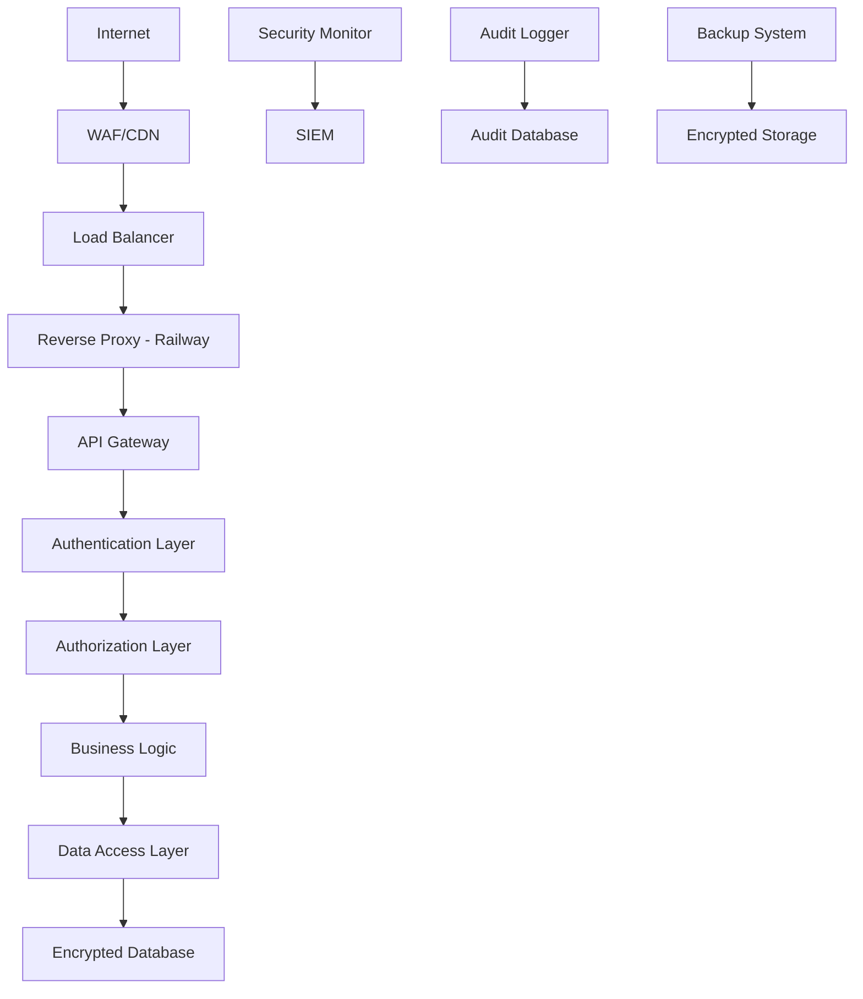
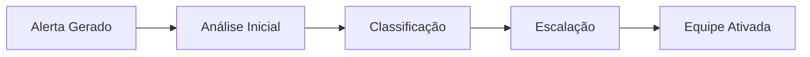

# 🛡️ DOCUMENTAÇÃO DE SEGURANÇA - SISTEMA PONTO DIGITAL

## 📋 ÍNDICE

1. [Visão Geral de Segurança](#visão-geral-de-segurança)
2. [Arquitetura de Segurança](#arquitetura-de-segurança)
3. [Políticas de Segurança](#políticas-de-segurança)
4. [Controles de Acesso](#controles-de-acesso)
5. [Proteção de Dados (LGPD)](#proteção-de-dados-lgpd)
6. [Criptografia e Hashing](#criptografia-e-hashing)
7. [Monitoramento e Auditoria](#monitoramento-e-auditoria)
8. [Resposta a Incidentes](#resposta-a-incidentes)
9. [Testes de Segurança](#testes-de-segurança)
10. [Compliance e Certificações](#compliance-e-certificações)

---

## 🔒 VISÃO GERAL DE SEGURANÇA

### Objetivo
O Sistema Ponto Digital foi desenvolvido com **segurança por design**, implementando múltiplas camadas de proteção para garantir a confidencialidade, integridade e disponibilidade dos dados biométricos e informações pessoais dos colaboradores.

### Princípios de Segurança
- **🛡️ Defesa em Profundidade**: Múltiplas camadas de segurança
- **🔐 Princípio do Menor Privilégio**: Acesso mínimo necessário
- **🚫 Falha Segura**: Sistema falha de forma segura
- **🔍 Transparência**: Auditoria completa de todas as ações
- **🔄 Segurança Contínua**: Monitoramento e atualização constante

### Classificação de Dados
```
CRÍTICO     - Dados biométricos, CPF, senhas
SENSÍVEL    - Registros de ponto, localização, relatórios
INTERNO     - Configurações, logs de sistema
PÚBLICO     - Documentação, políticas públicas
```

---

## 🏗️ ARQUITETURA DE SEGURANÇA

### Diagrama de Segurança


### Componentes de Segurança

#### 1. **Perímetro de Segurança**
- **HTTPS Obrigatório**: TLS 1.3 em todas as comunicações
- **HSTS**: HTTP Strict Transport Security habilitado
- **CSP**: Content Security Policy restritiva
- **CORS**: Cross-Origin Resource Sharing controlado

#### 2. **Autenticação e Autorização**
- **JWT**: JSON Web Tokens com assinatura RSA-256
- **MFA**: Autenticação Multi-Fator opcional
- **RBAC**: Role-Based Access Control
- **Session Management**: Controle rigoroso de sessões

#### 3. **Proteção de Dados**
- **Criptografia AES-256-GCM**: Para dados biométricos
- **Hashing SHA-256**: Para senhas e tokens
- **Mascaramento**: Dados sensíveis em logs
- **Tokenização**: CPF e dados pessoais

#### 4. **Monitoramento**
- **SIEM**: Security Information and Event Management
- **IDS/IPS**: Detecção e prevenção de intrusões
- **Threat Intelligence**: Análise de ameaças
- **Real-time Monitoring**: Monitoramento em tempo real

---

## 📜 POLÍTICAS DE SEGURANÇA

### 1. **Política de Senhas**
```yaml
Requisitos:
  - Mínimo: 8 caracteres
  - Complexidade: Maiúscula, minúscula, número, símbolo
  - Histórico: Últimas 5 senhas não podem ser reutilizadas
  - Expiração: 90 dias para usuários administrativos
  - Bloqueio: 5 tentativas incorretas = bloqueio 15 minutos
```

### 2. **Política de Acesso**
```yaml
Princípios:
  - Menor privilégio necessário
  - Segregação de funções
  - Revisão periódica de acessos (90 dias)
  - Provisionamento e desprovisionamento controlado
  - Acesso baseado em função (RBAC)
```

### 3. **Política de Dados Biométricos**
```yaml
Proteções:
  - Criptografia AES-256-GCM obrigatória
  - Chaves rotacionadas mensalmente
  - Acesso apenas para funções autorizadas
  - Log de todos os acessos
  - Retenção máxima: conforme LGPD
  - Exclusão segura ao término do contrato
```

### 4. **Política de Backup e Recuperação**
```yaml
Backup:
  - Criptografia AES-256 em repouso
  - Backup diário automatizado
  - Teste de restauração mensal
  - Armazenamento geograficamente distribuído
  - Retenção: 7 diários, 4 semanais, 12 mensais
```

---

## 🔐 CONTROLES DE ACESSO

### Matriz de Acesso (RBAC)

| Recurso | ADMIN | RH | GESTOR | COLABORADOR | TOTEM |
|---------|-------|----|---------|-----------|----- |
| **Usuários** | ✅ CRUD | ❌ | ❌ | ❌ | ❌ |
| **Colaboradores** | ✅ CRUD | ✅ CRUD | 👁️ Read | 👁️ Próprio | ❌ |
| **Registros** | ✅ CRUD | 👁️ Read | 👁️ Read | 👁️ Próprio | ✅ Create |
| **Relatórios** | ✅ All | ✅ All | 👁️ Equipe | ❌ | ❌ |
| **Configurações** | ✅ CRUD | ❌ | ❌ | ❌ | ❌ |
| **Auditoria** | 👁️ Read | ❌ | ❌ | ❌ | ❌ |
| **Biometria** | ✅ CRUD | ✅ CRUD | ❌ | ✅ Próprio | ✅ Verify |

### Implementação Técnica

#### 1. **Authentication Middleware**
```javascript
// Exemplo de implementação
const authMiddleware = async (req, res, next) => {
  try {
    const token = extractToken(req);
    const decoded = jwt.verify(token, JWT_SECRET);
    const user = await getUserById(decoded.id);
    
    if (!user || !user.ativo) {
      return res.status(401).json({ error: 'Usuário inválido' });
    }
    
    req.user = user;
    next();
  } catch (error) {
    return res.status(401).json({ error: 'Token inválido' });
  }
};
```

#### 2. **Authorization Middleware**
```javascript
// Controle baseado em roles
const requireRole = (allowedRoles) => {
  return (req, res, next) => {
    if (!allowedRoles.includes(req.user.perfil)) {
      return res.status(403).json({ error: 'Acesso negado' });
    }
    next();
  };
};
```

#### 3. **Rate Limiting**
```javascript
// Limitação de taxa por endpoint
const rateLimits = {
  login: { windowMs: 15 * 60 * 1000, max: 5 },
  api: { windowMs: 15 * 60 * 1000, max: 1000 },
  face: { windowMs: 1 * 60 * 1000, max: 10 }
};
```

---

## 🔒 PROTEÇÃO DE DADOS (LGPD)

### Conformidade LGPD

#### 1. **Base Legal**
- **Execução de Contrato**: Registros de ponto para controle trabalhista
- **Interesse Legítimo**: Segurança e controle de acesso
- **Consentimento**: Dados biométricos (quando aplicável)

#### 2. **Direitos dos Titulares**
```yaml
Direitos Implementados:
  - Confirmação de tratamento ✅
  - Acesso aos dados ✅
  - Correção de dados ✅
  - Anonimização/bloqueio ✅
  - Eliminação ✅
  - Portabilidade ✅
  - Informação sobre compartilhamento ✅
  - Revogação do consentimento ✅
```

#### 3. **Medidas de Proteção**

##### **Mascaramento de Dados**
```javascript
// Implementação de mascaramento
const maskCPF = (cpf) => {
  return cpf.replace(/(\d{3})\d{5}(\d{2})/, '$1.*****$2');
};

const maskEmail = (email) => {
  return email.replace(/(.{2}).*(@.*)/, '$1****$2');
};
```

##### **Logs Seguros**
```javascript
// Console seguro que mascara dados automaticamente
const safeConsole = {
  log: (message) => {
    const maskedMessage = maskSensitiveData(message);
    console.log(maskedMessage);
  }
};
```

##### **Criptografia de Dados Biométricos**
```javascript
// AES-256-GCM para dados biométricos
const encryptBiometric = (data, key) => {
  const cipher = crypto.createCipheriv('aes-256-gcm', key, iv);
  let encrypted = cipher.update(data, 'utf8', 'hex');
  encrypted += cipher.final('hex');
  const authTag = cipher.getAuthTag();
  return { encrypted, authTag };
};
```

#### 4. **Retenção de Dados**
```yaml
Políticas de Retenção:
  Registros de Ponto: 5 anos (CLT)
  Dados Biométricos: Até término do contrato + 30 dias
  Logs de Auditoria: 1 ano
  Logs de Sistema: 90 dias
  Backups: 1 ano com exclusão automática
```

---

## 🔐 CRIPTOGRAFIA E HASHING

### Algoritmos Utilizados

#### 1. **Criptografia Simétrica**
```yaml
AES-256-GCM:
  - Uso: Dados biométricos, backups
  - Chave: 256 bits
  - IV: 96 bits (único por operação)
  - Autenticação: GCM mode
  - Rotação: Mensal
```

#### 2. **Hashing**
```yaml
SHA-256:
  - Uso: Senhas, tokens, integridade
  - Salt: 32 bytes aleatórios
  - Iterações: 100,000 (PBKDF2)
  - Verificação: Tempo constante
```

#### 3. **Assinatura Digital**
```yaml
RSA-2048:
  - Uso: JWT tokens, API signatures
  - Chave: 2048 bits
  - Padding: OAEP
  - Hash: SHA-256
```

### Implementação de Segurança

#### **Gerenciamento de Chaves**
```javascript
// Rotação automática de chaves
class BiometricKeyManager {
  async rotateMasterKey() {
    const newKey = crypto.randomBytes(32);
    const oldKey = await this.getCurrentKey();
    
    // Re-encrypt all data with new key
    await this.reencryptAllData(oldKey, newKey);
    
    // Store new key securely
    await this.storeKey(newKey);
    
    this.logKeyOperation('ROTATION', 'SUCCESS');
  }
}
```

#### **Validação de Integridade**
```javascript
// Verificação de integridade de dados
const verifyDataIntegrity = (data, hash) => {
  const calculatedHash = crypto
    .createHash('sha256')
    .update(data)
    .digest('hex');
  
  return crypto.timingSafeEqual(
    Buffer.from(hash, 'hex'),
    Buffer.from(calculatedHash, 'hex')
  );
};
```

---

## 📊 MONITORAMENTO E AUDITORIA

### Sistema de Auditoria

#### 1. **Eventos Auditados**
```yaml
Autenticação:
  - Login/Logout
  - Falhas de autenticação
  - Mudanças de senha
  - Criação/exclusão de usuários

Autorização:
  - Acesso negado
  - Escalação de privilégios
  - Mudanças de permissões

Dados:
  - Acesso a dados sensíveis
  - Modificação de dados
  - Exportação de relatórios
  - Backup/Restore

Sistema:
  - Inicialização/Parada
  - Mudanças de configuração
  - Atualizações de sistema
  - Falhas críticas
```

#### 2. **Estrutura de Log**
```json
{
  "timestamp": "2024-01-15T10:30:00Z",
  "eventId": "EVT-001-AUTH-LOGIN",
  "userId": "user123",
  "userRole": "ADMIN",
  "action": "LOGIN",
  "resource": "/api/auth/login",
  "sourceIP": "192.168.1.100",
  "userAgent": "Mozilla/5.0...",
  "result": "SUCCESS",
  "riskLevel": "LOW",
  "additionalData": {
    "sessionId": "sess-abc123",
    "mfaUsed": true,
    "location": "São Paulo, BR"
  }
}
```

#### 3. **Alertas de Segurança**
```yaml
Alertas Críticos:
  - Múltiplas falhas de autenticação
  - Acesso de IPs suspeitos
  - Tentativas de SQL Injection
  - Acesso fora do horário comercial
  - Exportação em massa de dados
  - Mudanças de configuração crítica

Alertas de Aviso:
  - Acesso de novo dispositivo
  - Tentativas de acesso negado
  - Performance degradada
  - Uso anômalo de recursos
```

### Monitoramento em Tempo Real

#### **Security Information and Event Management (SIEM)**
```javascript
// Monitor de segurança em tempo real
class SecurityMonitor {
  detectSuspiciousActivity(event) {
    const riskScore = this.calculateRiskScore(event);
    
    if (riskScore > 80) {
      this.triggerAlert('CRITICAL', event);
      this.blockIP(event.sourceIP);
    } else if (riskScore > 60) {
      this.triggerAlert('HIGH', event);
    }
    
    this.updateThreatIntelligence(event);
  }
}
```

#### **Métricas de Segurança**
```yaml
KPIs de Segurança:
  - Taxa de tentativas de login falhadas
  - Tempo médio de detecção de incidentes
  - Número de alertas por dia
  - Taxa de falsos positivos
  - Cobertura de monitoramento
  - Tempo de resposta a incidentes
```

---

## 🚨 RESPOSTA A INCIDENTES

### Plano de Resposta a Incidentes (IRP)

#### 1. **Classificação de Incidentes**
```yaml
CRÍTICO (P1):
  - Vazamento de dados biométricos
  - Acesso não autorizado a dados sensíveis
  - Comprometimento de sistema crítico
  - Ataques de ransomware
  Tempo de Resposta: 15 minutos

ALTO (P2):
  - Tentativas de invasão
  - Falhas de autenticação em massa
  - Indisponibilidade parcial do sistema
  - Violação de políticas de segurança
  Tempo de Resposta: 1 hora

MÉDIO (P3):
  - Alertas de segurança anômalos
  - Violações menores de política
  - Problemas de performance relacionados à segurança
  Tempo de Resposta: 4 horas

BAIXO (P4):
  - Eventos de segurança informativos
  - Atualizações de segurança rotineiras
  Tempo de Resposta: 24 horas
```

#### 2. **Processo de Resposta**

##### **Fase 1: Detecção e Análise**


##### **Fase 2: Contenção**
```yaml
Ações Imediatas:
  - Isolamento de sistemas comprometidos
  - Bloqueio de IPs suspeitos
  - Desativação de contas comprometidas
  - Preservação de evidências
  - Comunicação com stakeholders
```

##### **Fase 3: Erradicação e Recuperação**
```yaml
Ações de Recuperação:
  - Remoção de ameaças
  - Aplicação de patches
  - Restauração de backups
  - Validação de integridade
  - Testes de funcionamento
```

##### **Fase 4: Pós-Incidente**
```yaml
Atividades:
  - Documentação completa
  - Análise de causa raiz
  - Lições aprendidas
  - Melhoria de processos
  - Relatório executivo
```

#### 3. **Contatos de Emergência**
```yaml
Equipe de Resposta:
  CISO: +55 11 99999-0001
  Administrador de Sistema: +55 11 99999-0002
  DPO (LGPD): +55 11 99999-0003
  Jurídico: +55 11 99999-0004

Externos:
  Polícia Civil - Crimes Cibernéticos: 147
  ANPD (LGPD): anpd@anpd.gov.br
  CERT.br: cert@cert.br
```

---

## 🧪 TESTES DE SEGURANÇA

### Programa de Testes de Segurança

#### 1. **Testes Automatizados**
```yaml
Testes Diários:
  - Verificação de vulnerabilidades conhecidas
  - Testes de autenticação e autorização
  - Validação de configurações de segurança
  - Verificação de integridade de dados

Testes Semanais:
  - Scan de vulnerabilidades
  - Testes de penetração automatizados
  - Análise de logs de segurança
  - Verificação de backups

Testes Mensais:
  - Penetration testing completo
  - Auditoria de acessos
  - Revisão de políticas
  - Simulação de incidentes
```

#### 2. **Ferramentas de Teste**

##### **Testes de Penetração**
```javascript
// Framework de testes implementado
class PenTestFramework {
  async runSecurityTests() {
    const results = {
      sqlInjection: await this.testSQLInjection(),
      xss: await this.testXSS(),
      authBypass: await this.testAuthBypass(),
      bruteForce: await this.testBruteForce(),
      fileUpload: await this.testFileUpload()
    };
    
    return this.generateReport(results);
  }
}
```

##### **Simulação de Ataques**
```javascript
// Simulador de ataques implementado
const attackScenarios = {
  'Script Kiddie': {
    techniques: ['SQL Injection', 'XSS', 'Brute Force'],
    intensity: 'LOW',
    duration: 300 // 5 minutes
  },
  'Advanced APT': {
    techniques: ['Advanced SQL', 'Auth Bypass', 'Privilege Escalation'],
    intensity: 'HIGH',
    duration: 1800 // 30 minutes
  }
};
```

#### 3. **Métricas de Segurança**
```yaml
Métricas Coletadas:
  - Taxa de bloqueio de ataques: >95%
  - Tempo de detecção: <5 minutos
  - Falsos positivos: <5%
  - Cobertura de testes: >90%
  - Vulnerabilidades críticas: 0
  - Tempo de correção: <24h para críticas
```

---

## ✅ COMPLIANCE E CERTIFICAÇÕES

### Conformidade Regulatória

#### 1. **LGPD (Lei Geral de Proteção de Dados)**
```yaml
Status: ✅ CONFORME

Implementações:
  - Mapeamento de dados pessoais ✅
  - Base legal documentada ✅
  - Direitos dos titulares implementados ✅
  - DPO designado ✅
  - Relatório de impacto (RIPD) ✅
  - Procedimentos de notificação ✅
  - Contratos de processamento ✅
```

#### 2. **ISO 27001 (Gestão de Segurança)**
```yaml
Status: 🔄 EM IMPLEMENTAÇÃO

Controles Implementados:
  - A.5: Políticas de Segurança ✅
  - A.6: Organização da Segurança ✅
  - A.7: Segurança de RH ✅
  - A.8: Gestão de Ativos ✅
  - A.9: Controle de Acesso ✅
  - A.10: Criptografia ✅
  - A.11: Segurança Física ⚠️
  - A.12: Segurança Operacional ✅
  - A.13: Segurança de Comunicações ✅
  - A.14: Desenvolvimento Seguro ✅
  - A.15: Relacionamento com Fornecedores ⚠️
  - A.16: Gestão de Incidentes ✅
  - A.17: Continuidade do Negócio ⚠️
  - A.18: Conformidade ✅
```

#### 3. **NIST Cybersecurity Framework**
```yaml
Status: ✅ CONFORME

Funções Implementadas:
  IDENTIFY:
    - Gestão de ativos ✅
    - Ambiente de negócios ✅
    - Governança ✅
    - Avaliação de riscos ✅

  PROTECT:
    - Controle de acesso ✅
    - Conscientização e treinamento ✅
    - Segurança de dados ✅
    - Processos de proteção ✅
    - Tecnologias de proteção ✅

  DETECT:
    - Anomalias e eventos ✅
    - Monitoramento contínuo ✅
    - Processos de detecção ✅

  RESPOND:
    - Planejamento de resposta ✅
    - Comunicações ✅
    - Análise ✅
    - Mitigação ✅
    - Melhorias ✅

  RECOVER:
    - Planejamento de recuperação ✅
    - Melhorias ✅
    - Comunicações ✅
```

### Auditorias e Certificações

#### **Cronograma de Auditorias**
```yaml
2024:
  Q1: Auditoria interna LGPD ✅
  Q2: Penetration Testing externo ✅
  Q3: Auditoria ISO 27001 🔄
  Q4: Auditoria de compliance ⏳

2025:
  Q1: Certificação ISO 27001
  Q2: Auditoria LGPD externa
  Q3: Recertificação SOC 2
  Q4: Auditoria de segurança completa
```

#### **Documentação de Compliance**
```yaml
Documentos Mantidos:
  - Políticas de segurança atualizadas
  - Procedimentos operacionais
  - Registros de treinamento
  - Logs de auditoria
  - Relatórios de incidentes
  - Avaliações de risco
  - Planos de continuidade
  - Contratos de terceiros
```

---

## 📚 RECURSOS ADICIONAIS

### Documentação Técnica
- [Guia de Implementação de Segurança](./SECURITY_IMPLEMENTATION.md)
- [Manual de Resposta a Incidentes](./INCIDENT_RESPONSE.md)
- [Procedimentos de Backup e Recuperação](./BACKUP_PROCEDURES.md)
- [Guia de Auditoria](./AUDIT_GUIDE.md)

### Treinamentos
- [Conscientização em Segurança](./SECURITY_AWARENESS.md)
- [Resposta a Incidentes](./INCIDENT_RESPONSE_TRAINING.md)
- [LGPD e Proteção de Dados](./LGPD_TRAINING.md)

### Contatos
- **CISO**: security@pontodigital.com
- **DPO**: dpo@pontodigital.com
- **Suporte**: suporte@pontodigital.com
- **Emergência**: +55 11 99999-0000

---

## 🔄 CONTROLE DE VERSÕES

| Versão | Data | Autor | Alterações |
|--------|------|-------|------------|
| 1.0 | 2024-01-15 | Equipe Segurança | Versão inicial |
| 1.1 | 2024-02-01 | CISO | Adição NIST Framework |
| 1.2 | 2024-03-01 | DPO | Atualização LGPD |

---

**📞 Para dúvidas ou emergências de segurança, entre em contato imediatamente com a equipe de segurança.**

**🔒 Este documento contém informações sensíveis e deve ser tratado com confidencialidade apropriada.**
